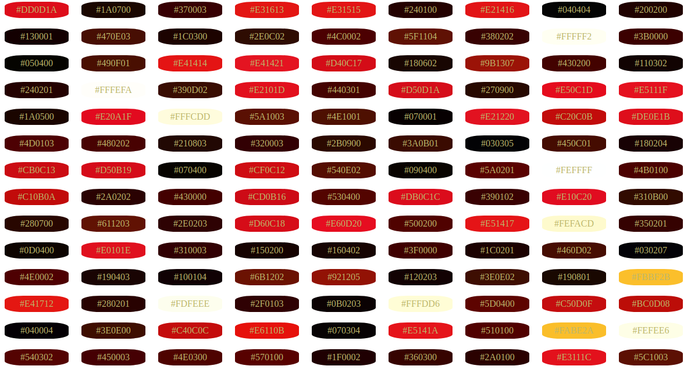

# Extract color using (league/color-extractor)
## Install

&rarr; &rarr; Via Composer

``` bash
$ composer require league/color-extractor:0.3.*
```
### Image used for demonstration is available under **Creative Commons (CC)**

<em><strong>&rarr;  Image Reference Link : </strong> </em> <br/>
http://thefuturebuzz.com/pics/creative%20commons/9.jpg

<p>

</p>

<h3>&rarr;  CSS setup for grid like look and feel</h3>

```css
div.cell {
    border: 2px solid white;
    display: inline-grid;
    padding: 5px;
    margin: 7px;
    width: 100px;
    text-align: center;
    border-radius: 30%;
    color: darkkhaki;
} 
```
###  &rarr; Output:
<p>
    
</p>

####  Thanks :v:
